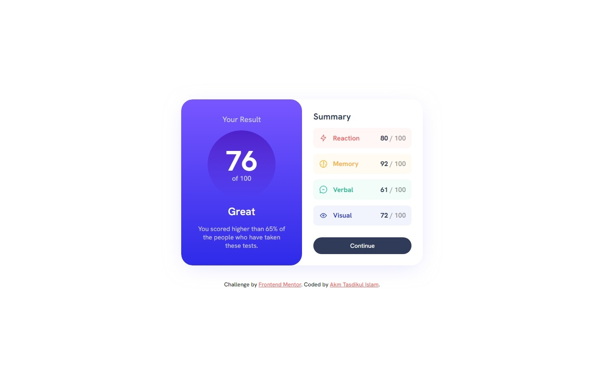
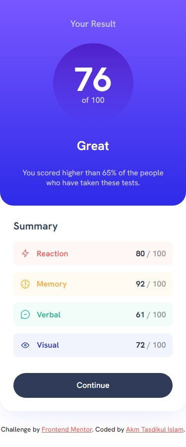

# Frontend Mentor - Results summary component solution

This is a solution to the [Results summary component challenge on Frontend Mentor](https://www.frontendmentor.io/challenges/results-summary-component-CE_K6s0maV). Frontend Mentor challenges help you improve your coding skills by building realistic projects.

## Table of contents

- [Overview](#overview)
  - [The challenge](#the-challenge)
  - [Screenshot](#screenshot)
  - [Links](#links)
- [My process](#my-process)
  - [Built with](#built-with)
  - [What I learned](#what-i-learned)
  - [Useful resources](#useful-resources)
- [Author](#author)

## Overview

Project Start Date: 17 February 2024
Project Duration: 01 hour 43 minutes

### The challenge

Users should be able to:

- View the optimal layout for the interface depending on their device's screen size
- See hover and focus states for all interactive elements on the page
- **Bonus**: Use the local JSON data to dynamically populate the content. [REACT JS Version](https://github.com/akmtasdikulislam/results-summary-component-react)

### Screenshot

| Desktop Version                        | Mobile Version                        |
| -------------------------------------- | ------------------------------------- |
|  |  |

### Links

- [Solution URL](https://github.com/akmtasdikulislam/results-summary-component)
- [Live Site URL](https://akmtasdikulislam.github.io/results-summary-component/)

## My process

- At first, I linked the `style.css` file and the Google Fonts CDN with the `index.html` file.
- Then, imported the colour variables into the _css_ file from `style-guide.md` file and set the instructed base _font-size_ for this project. Also, I initialized the css file.
- After initialization, I wrote necessary `html` code to structure the _desktop-version of the UI Design Sample_ and also wrote necessary _css_ code to match the design as close as possible.
- After completing the _desktop-version UI development_, I wrote necessary _CSS Media Queries_ to develop the _mobile-version UI design_.

### Built with

- Semantic HTML5 markup
- CSS custom properties
- Flexbox

### What I learned

By doing this project, I learned about css `linear-gradient()` and `box-shadow`.

**Linear Gradient**

```css
background-image: linear-gradient(
  to bottom,
  var(--light-slate-blue) 0%,
  var(--light-royal-blue) 100%
);
```

**CSS box-shadow**

```css
box-shadow: 0 10px 50px -12px hsla(241, 100%, 89%, 0.6);
```

### Useful resources

- [linear-gradient()](https://developer.mozilla.org/en-US/docs/Web/CSS/gradient/linear-gradient) - This helped me to learn about css `linear-gradient` property.
- [box-shadow](https://developer.mozilla.org/en-US/docs/Web/CSS/box-shadow) - This helped me to learn about css `box-shadow` property.

## Author

- Frontend Mentor - [@akmtasdikulislam](https://www.frontendmentor.io/profile/akmtasdikulislam)
- Twitter - [@Akm_Tasdikul](https://www.twitter.com/Akm_Tasdikul)
